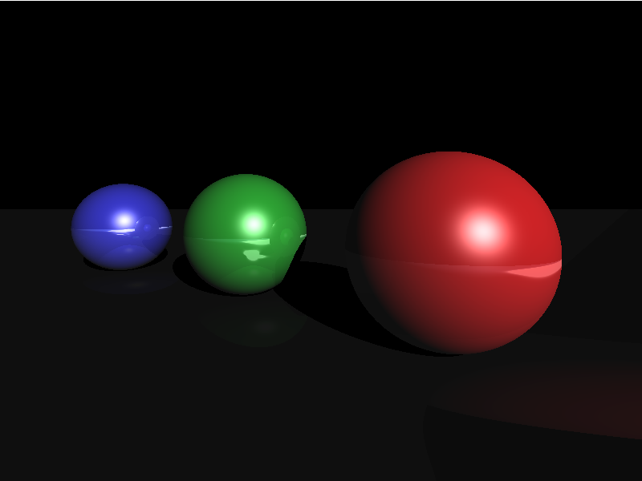

# JSRay
A simple Javascript RayTracer

The ray tracer lives in a single .js file and is far from perfect :) However, it served its purpose to let me practice a little with Javascript (I have almost no other experience with it).

To see the render in action, just clone the repo and open the index.html file.

Here is a picture of the resulting render.
